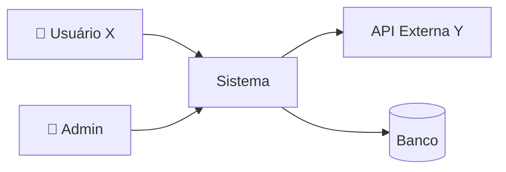
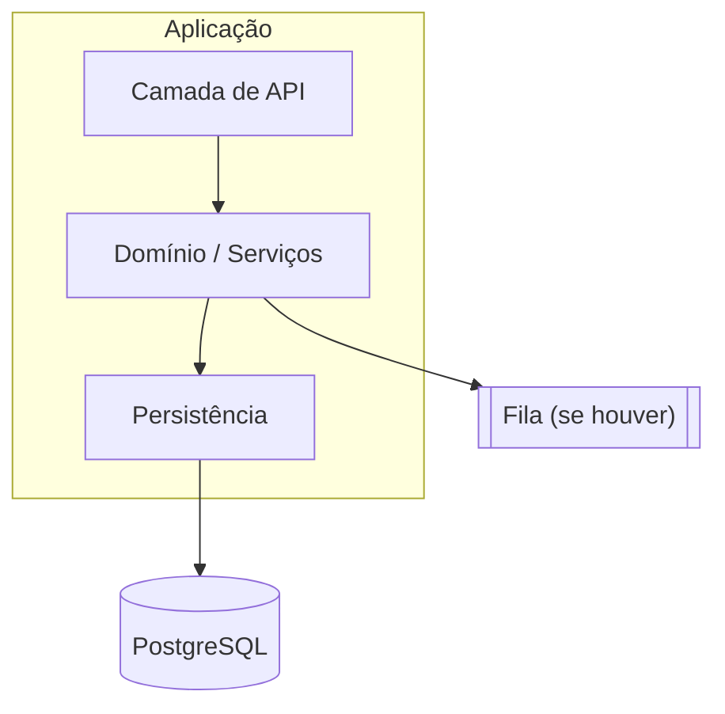
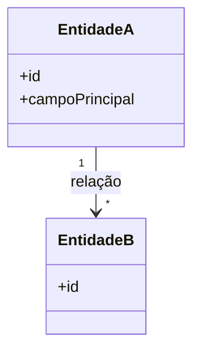
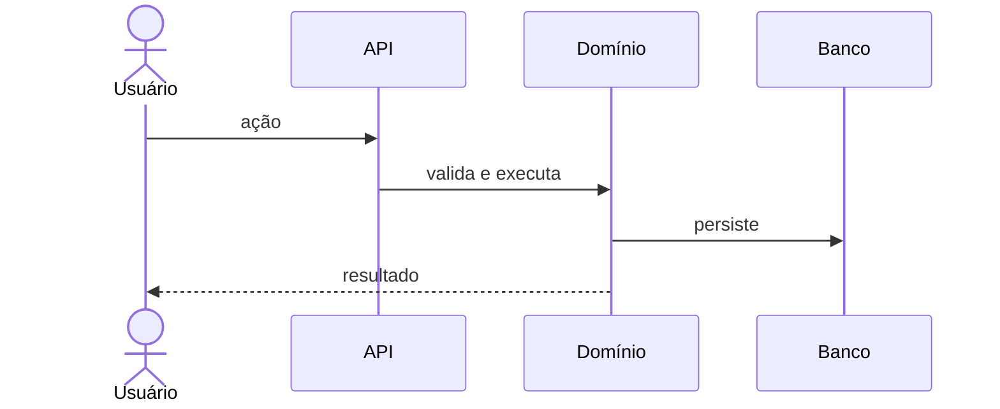

# doc.md — [Nome do Projeto]

> Mini-UML da aplicação, gerado pela descoberta (`iniciar-projeto`, roles.md §6.15) em AAAA-MM-DD.
> Atualizar sempre que a arquitetura, o domínio ou um fluxo crítico mudar — este arquivo deve refletir o sistema real.

## 1. Visão

[2–4 frases: o problema, para quem, e o que o sistema faz. Objetivo de negócio mensurável.]

- **Público-alvo:** [perfil]
- **Metodologia:** fluxo de governança multiagente (roles.md §2): descoberta → roadmap → task → refinamento → PRD → implementação → auditoria → push → PR → CI/CD

## 2. Atores

| Ator | Tipo | O que faz no sistema |
|---|---|---|
| [Usuário X] | humano | [ações principais] |
| [Sistema Y] | sistema externo | [integração] |

## 3. Diagrama de contexto

## 4. Componentes

[Um parágrafo do estilo arquitetural escolhido (ex.: monolito modular) e por quê.]

## 5. Modelo de domínio

## 6. Fluxos críticos

### 6.1 [Nome do fluxo]

[Repetir para cada fluxo crítico levantado no bloco B.]

## 7. Requisitos não funcionais

| Requisito | Alvo | Origem |
|---|---|---|
| Latência | [< X ms nas operações principais] | bloco C |
| Disponibilidade | [ex.: 99,9%] | bloco C |
| Compliance | [LGPD / ...] | bloco C |
| RPO / RTO | [X / Y] | bloco C |

## 8. Volumetria assumida

| Métrica | Estimativa | Confiança |
|---|---|---|
| Usuários ativos | [N] | [declarada / assumida] |
| Req/s (pico) | [N] | |
| Crescimento 12m | [N×] | |
| Dados/dia | [N registros] | |

## 9. Stack e infraestrutura

| Camada | Escolha | Motivo (resumo) |
|---|---|---|
| Linguagem | | |
| Framework | | |
| Banco | | |
| Infra/deploy | | |
| CI/CD | | |

Detalhes e versões: `lib.md`. Custo mensal estimado: [R$ X, dentro do budget declarado].

## 10. Trade-offs aceitos

| Decisão | Alternativa descartada | Trade-off aceito | Quem decidiu |
|---|---|---|---|
| [escolha] | [alternativa] | [o que se perde e por que é aceitável] | usuário / consenso agentes |

## 11. Candidatas a ADR

Decisões arquiteturais relevantes identificadas na descoberta — criar apenas com autorização explícita (roles.md §6.1):

- [ ] [decisão candidata 1]
- [ ] [decisão candidata 2]

## 12. Integrações e dependências externas

| Integração | Criticidade | SLA/custo | Risco |
|---|---|---|---|
| [API Y] | [bloqueia MVP?] | | |

## 13. Observabilidade e resiliência

### Ferramentas

| Sinal | Ferramenta | Custo estimado |
|---|---|---|
| Métricas | [ex.: Prometheus + Grafana] | |
| Logs | [ex.: Loki / ELK] | |
| Traces | [ex.: OTel + Tempo / correlation ID apenas] | |
| Alertas | [ex.: Alertmanager → canal X] | |

### Métricas-chave e SLOs

| Métrica | Tipo | Alvo/SLO |
|---|---|---|
| [p95 endpoint principal] | técnica (RED) | [< X ms] |
| [taxa de erro] | técnica | [< X%] |
| [evento de negócio] | negócio | [meta] |

### Logs

- **Formato:** [JSON estruturado com correlation/trace ID]
- **Nunca logar:** PII, tokens, credenciais (roles.md §6.6)
- **Agregação e retenção:** [onde, por quanto tempo]
- **Dashboards do dia 1:** [lista]

### Padrões de resiliência adotados

| Padrão | Onde se aplica | Compensação/rollback |
|---|---|---|
| [saga orquestrada] | [fluxo X entre serviços A→B] | [passo a passo da compensação] |
| [retry + circuit breaker] | [chamadas à API Y] | [timeout, backoff, fallback] |
| [outbox + DLQ + idempotência] | [eventos de Z] | [reprocessamento] |
| [rollback de deploy] | [blue/green / canary] | [alinhado a expand-contract §6.10.4] |

### Healthchecks

- **Liveness:** [o que valida]
- **Readiness:** [o que valida — banco, fila, dependência crítica]
